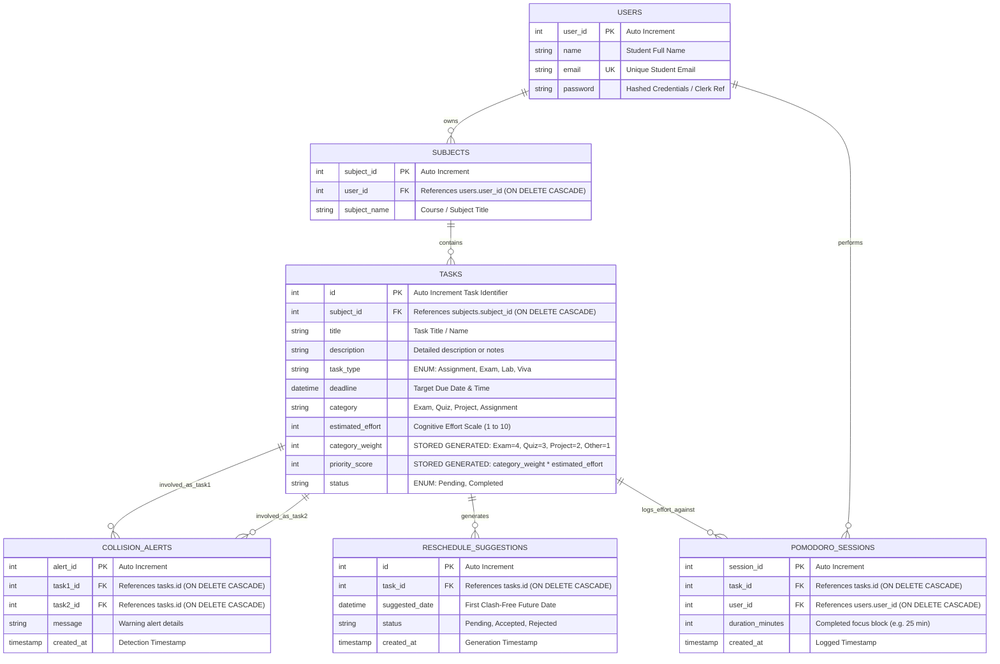
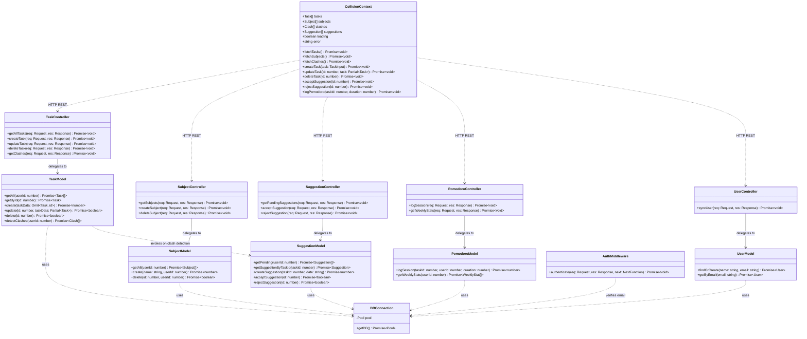
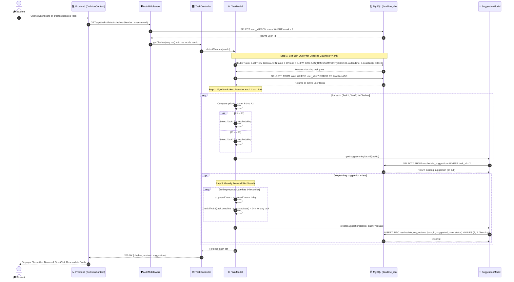
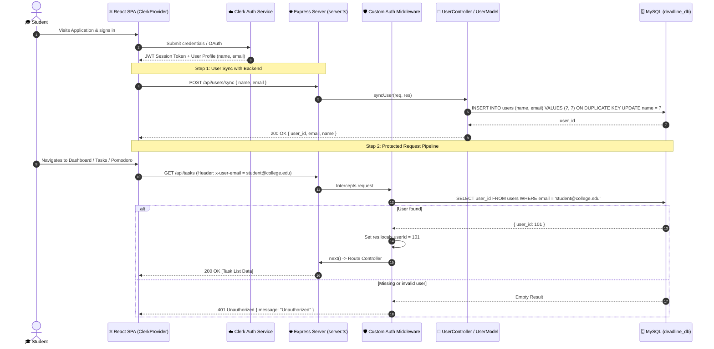
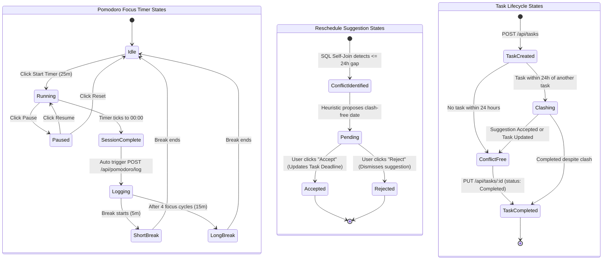

# 📐 System Design Document: High-Level (HLD) & Low-Level Design (LLD)

**Project:** StudySync — Student Academic Workload Balancing, Collision Scheduling & Focused Time Tracking  
**Context:** Minor Project — Software Engineering Architecture  
**Tech Stack:** React 19, TypeScript 5.8, Tailwind CSS v4, Express 4, MySQL 8.0, Clerk Auth  

---

## Table of Contents

1. [High-Level Design (HLD)](#1-high-level-design-hld)
   - [1.1 End-to-End System Architecture](#11-end-to-end-system-architecture)
   - [1.2 Data Flow & Request-Response Pipeline](#12-data-flow--request-response-pipeline)
   - [1.3 Runtime & Deployment Topology](#13-runtime--deployment-topology)
2. [Low-Level Design (LLD)](#2-low-level-design-lld)
   - [2.1 Database Schema & Entity Relationship Diagram (ERD)](#21-database-schema--entity-relationship-diagram-erd)
   - [2.2 Backend Class & Module Architecture](#22-backend-class--module-architecture)
   - [2.3 Sequence Diagram: Deadline Collision & Greedy Rescheduling](#23-sequence-diagram-deadline-collision--greedy-rescheduling)
   - [2.4 Sequence Diagram: Authentication & API Authorization](#24-sequence-diagram-authentication--api-authorization)
   - [2.5 System State Machines](#25-system-state-machines)
3. [Algorithmic Specifications](#3-algorithmic-specifications)
4. [Source Mermaid Files](#4-source-mermaid-files)

---

## 1. High-Level Design (HLD)

The High-Level Design defines the 4-tier architecture of StudySync:
- **Presentation Tier:** React 19 Single-Page Application (SPA) with route-level code splitting (`React.lazy`), memoized context state (`CollisionContext`), and Neo-Brutalist styling.
- **Identity Tier:** Clerk Cloud Authentication handling identity verification, user sessions, and JWT tokens.
- **Application Tier:** Express 4 REST API in TypeScript utilizing the Model-View-Controller (MVC) pattern, featuring a custom email-based authorization middleware, SQL self-join clash detection, and a greedy heuristic forward-search rescheduler.
- **Persistence Tier:** MySQL 8.0 with foreign key cascade guarantees, connection pooling (`mysql2/promise`), and schema-level generated columns for urgency computation.

### 1.1 End-to-End System Architecture

```mermaid
flowchart TB
    %% Presentation Layer
    subgraph FrontendTier ["🎨 1. Presentation Tier (React 19 + Vite 6 + Tailwind CSS)"]
        User(["🎓 Student User"])

        subgraph ClientAuth ["Auth & Session Management"]
            ClerkReact["Clerk React Provider\n(<ClerkProvider>, useUser, useAuth)"]
            TokenStorage["Session JWT & Email State\n(x-user-email Header Injection)"]
        end

        subgraph StateManagement ["Context & Cache Layer"]
            CollisionContext["CollisionContext\n• tasks: Task[]\n• subjects: Subject[]\n• clashes: Clash[]\n• suggestions: Suggestion[]\n• memoized actions (useCallback)"]
        end

        subgraph PageRoutes ["Client-Side Routing (React Router DOM v7)"]
            RouteDashboard["/ (DashboardPage)\n• SectionStat metrics\n• Clash Alert Banner\n• RecommendationCard\n• TaskCard grid"]
            RouteTasks["/tasks (TasksPage)\n• Filter by Subject & Type\n• Search & Sort\n• Modals: Add, Edit, Delete"]
            RouteCalendar["/calendar (CalendarPage)\n• Precomputed tasksByDay Map\n• Monthly interactive grid"]
            RouteAnalytics["/analytics (AnalyticsPage)\n• Category Breakdown\n• Priority Distribution\n• Pomodoro Rolling 7-Day"]
            RoutePomodoro["/pomodoro (PomodoroPage)\n• 25m Focus / 5m Break / 15m Long\n• Task Association & DB Session Log"]
        end

        subgraph ReusableComponents ["Modular UI Components"]
            CompTaskCard["TaskCard.tsx"]
            CompTaskModal["TaskFormModal.tsx"]
            CompSubjectModal["SubjectModal.tsx"]
            CompDeleteModal["DeleteConfirmationModal.tsx"]
            CompSectionStat["SectionStat.tsx"]
            CompNavbar["Navbar.tsx (Responsive Nav)"]
            CompThemeToggle["ThemeToggle.tsx (Dark/Light)"]
        end
    end

    %% External Identity
    subgraph ExternalServices ["☁️ 2. External Services Tier"]
        ClerkCloud["Clerk Identity Platform\n• User Authentication & OAuth\n• Session Token Issuance"]
    end

    %% Application Layer
    subgraph BackendTier ["⚙️ 3. Application Tier (Express 4 + TypeScript + Node.js)"]
        ServerCore["server.ts\n• HTTP Server Listener (:3000)\n• Vite Dev HMR / Prod Static Dist"]

        subgraph MiddlewarePipeline ["HTTP Middleware Chain"]
            MW_CORS["CORS Middleware"]
            MW_JSON["express.json() Body Parser"]
            MW_Auth["Custom Auth Middleware\n• Validates x-user-email\n• Queries users table\n• Injects res.locals.userId"]
        end

        subgraph RouterLayer ["Express API Routers"]
            RouterTasks["/api/tasks (taskRoutes.ts)"]
            RouterSubjects["/api/subjects (subjectRoutes.ts)"]
            RouterSuggestions["/api/suggestions (suggestionRoutes.ts)"]
            RouterPomodoro["/api/pomodoro (pomodoroRoutes.ts)"]
            RouterUsers["/api/users (userRoutes.ts)"]
        end

        subgraph ControllerLayer ["Controllers (Request Orchestration)"]
            CtrlTask["taskController.ts\n• getAllTasks, createTask\n• updateTask, deleteTask\n• getClashes"]
            CtrlSubject["subjectController.ts\n• getSubjects, createSubject, deleteSubject"]
            CtrlSuggestion["suggestionController.ts\n• getPendingSuggestions\n• acceptSuggestion, rejectSuggestion"]
            CtrlPomodoro["pomodoroController.ts\n• logSession, getWeeklyStats"]
            CtrlUser["userController.ts\n• syncUser (Upsert)"]
        end

        subgraph AlgorithmicEngines ["Algorithmic & Heuristic Engine"]
            EngineClash["Self-Join Collision Engine\n• Window: ABS(diff(d1, d2)) < 86400s\n• Cross-subject detection"]
            EnginePriority["Academic Prioritization Evaluator\n• Exam=4, Quiz=3, Project=2, Other=1\n• Priority = CategoryWeight * Effort"]
            EngineReschedule["Greedy Forward Slot Search\n• Loops proposedDate = deadline + 1 day\n• Validates no conflict (|diff| < 24h)\n• Emits pending suggestion"]
        end

        subgraph ModelLayer ["Data Access Layer (Models - raw SQL)"]
            ModelTask["TaskModel.ts"]
            ModelSubject["SubjectModel.ts"]
            ModelSuggestion["SuggestionModel.ts"]
            ModelPomodoro["PomodoroModel.ts"]
            ModelUser["UserModel.ts"]
        end
    end

    %% Persistence Layer
    subgraph DatabaseTier ["🗄️ 4. Persistence Tier (MySQL 8.0 - deadline_db)"]
        DBPool["mysql2 Connection Pool (config/db.ts)"]

        subgraph DatabaseSchema ["Relational Schema & Constraints"]
            T_Users[("users\n• user_id (PK)\n• email (UK)\n• name, password")]
            T_Subjects[("subjects\n• subject_id (PK)\n• user_id (FK -> users)\n• subject_name")]
            T_Tasks[("tasks\n• id (PK)\n• subject_id (FK -> subjects)\n• title, description, deadline\n• category, estimated_effort (1-10)\n• category_weight (STORED GENERATED)\n• priority_score (STORED GENERATED)\n• status (Pending, Completed)")]
            T_Alerts[("collision_alerts\n• alert_id (PK)\n• task1_id, task2_id (FK -> tasks)\n• message, created_at")]
            T_Suggestions[("reschedule_suggestions\n• id (PK)\n• task_id (FK -> tasks)\n• suggested_date\n• status (Pending, Accepted, Rejected)")]
            T_Pomodoro[("pomodoro_sessions\n• session_id (PK)\n• task_id (FK -> tasks)\n• user_id (FK -> users)\n• duration_minutes, created_at")]
        end
    end

    %% Wiring
    User -->|"Interacts with Views"| PageRoutes
    PageRoutes --> ReusableComponents
    PageRoutes --> CollisionContext
    
    User -->|"Signs in / Signs up"| ClerkReact
    ClerkReact <-->|"OAuth2 / OIDC Token Exchange"| ClerkCloud
    ClerkReact --> TokenStorage

    CollisionContext -->|"Async Axios / Fetch with x-user-email"| ServerCore
    ServerCore --> MW_CORS --> MW_JSON --> MW_Auth

    MW_Auth -->|"Verifies email & extracts user_id"| T_Users
    MW_Auth --> RouterLayer

    RouterTasks --> CtrlTask
    RouterSubjects --> CtrlSubject
    RouterSuggestions --> CtrlSuggestion
    RouterPomodoro --> CtrlPomodoro
    RouterUsers --> CtrlUser

    CtrlTask --> ModelTask
    CtrlSubject --> ModelSubject
    CtrlSuggestion --> ModelSuggestion
    CtrlPomodoro --> ModelPomodoro
    CtrlUser --> ModelUser

    ModelTask --> EngineClash
    EngineClash --> EnginePriority
    EnginePriority --> EngineReschedule
    EngineReschedule --> ModelSuggestion

    ModelTask --> DBPool
    ModelSubject --> DBPool
    ModelSuggestion --> DBPool
    ModelPomodoro --> DBPool
    ModelUser --> DBPool

    DBPool --> DatabaseSchema

    %% DB Cascades
    T_Users -->|"1 : N (CASCADE)"| T_Subjects
    T_Subjects -->|"1 : N (CASCADE)"| T_Tasks
    T_Tasks -->|"1 : N (CASCADE)"| T_Alerts
    T_Tasks -->|"1 : N (CASCADE)"| T_Suggestions
    T_Tasks -->|"1 : N (CASCADE)"| T_Pomodoro
    T_Users -->|"1 : N (CASCADE)"| T_Pomodoro
```

---

## 2. Low-Level Design (LLD)

### 2.1 Database Schema & Entity Relationship Diagram (ERD)

The relational schema implements clean normalization with referential integrity rules (ON DELETE CASCADE) and schema-generated fields:

---

### 2.2 Backend Class & Module Architecture

The backend strictly adheres to the MVC separation of concerns:
- **Controllers** handle HTTP requests, input validation, and HTTP response codes.
- **Models** contain raw parameterized SQL queries via `mysql2/promise`.
- **Middlewares** authenticate requests and inject user context into `res.locals`.

---

### 2.3 Sequence Diagram: Deadline Collision & Greedy Rescheduling

This diagram outlines the complete sequence triggered whenever tasks are refreshed or created:

---

### 2.4 Sequence Diagram: Authentication & API Authorization

---

### 2.5 System State Machines

---

## 3. Algorithmic Specifications

### Priority Score Formulation (MCDM)
The priority score $P_s$ is calculated by combining qualitative category importance with quantitative effort:

$$\text{Category Weight } (W_c) = \begin{cases} 4 & \text{Exam} \\ 3 & \text{Quiz} \\ 2 & \text{Project} \\ 1 & \text{Assignment / Lab / Viva} \end{cases}$$

$$\text{Priority Score } (P_s) = W_c \times \text{Estimated Effort} \quad (\text{Effort} \in [1, 10])$$

### Clash Detection Formulation
$$\text{Clash}(T_i, T_j) \iff |T_i.\text{deadline} - T_j.\text{deadline}| < 86,400 \text{ seconds} \quad (i \ne j)$$

### Greedy Reschedule Search
$$\min \Delta d \in \{1, 2, 3, \dots\} \quad \text{s.t.} \quad \forall T_k \in \mathcal{T} \setminus \{T_{\text{target}}\}, \; |(T_{\text{target}}.\text{deadline} + \Delta d) - T_k.\text{deadline}| \ge 86,400 \text{ s}$$

---

## 4. Source Mermaid Files

All raw Mermaid `.mmd` diagram source files are located in the `docs/` folder:
- **HLD Architecture Diagram:** [docs/HLD.mmd](file:///c:/Users/Shivam%20Anand/OneDrive/Desktop/Projects/StudySync/docs/HLD.mmd)
- **Database ERD:** [docs/LLD_ERD.mmd](file:///c:/Users/Shivam%20Anand/OneDrive/Desktop/Projects/StudySync/docs/LLD_ERD.mmd)
- **Backend Class Diagram:** [docs/LLD_Class.mmd](file:///c:/Users/Shivam%20Anand/OneDrive/Desktop/Projects/StudySync/docs/LLD_Class.mmd)
- **Collision & Rescheduling Sequence:** [docs/LLD_Sequence_Clash.mmd](file:///c:/Users/Shivam%20Anand/OneDrive/Desktop/Projects/StudySync/docs/LLD_Sequence_Clash.mmd)
- **Authentication Lifecycle Sequence:** [docs/LLD_Sequence_Auth.mmd](file:///c:/Users/Shivam%20Anand/OneDrive/Desktop/Projects/StudySync/docs/LLD_Sequence_Auth.mmd)
- **System State Machines:** [docs/LLD_State.mmd](file:///c:/Users/Shivam%20Anand/OneDrive/Desktop/Projects/StudySync/docs/LLD_State.mmd)
- **Root Master Diagram:** [HLD_LLD.mmd](file:///c:/Users/Shivam%20Anand/OneDrive/Desktop/Projects/StudySync/HLD_LLD.mmd)
