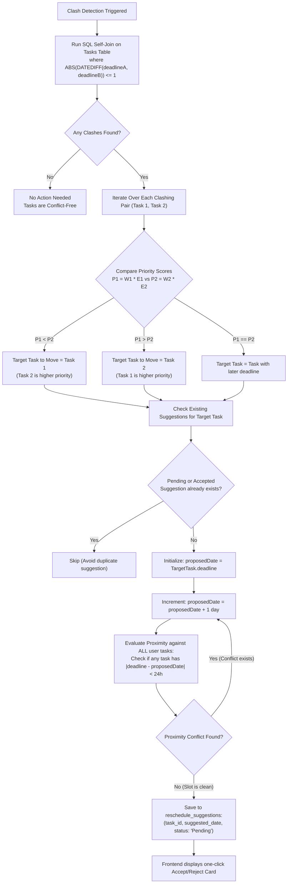
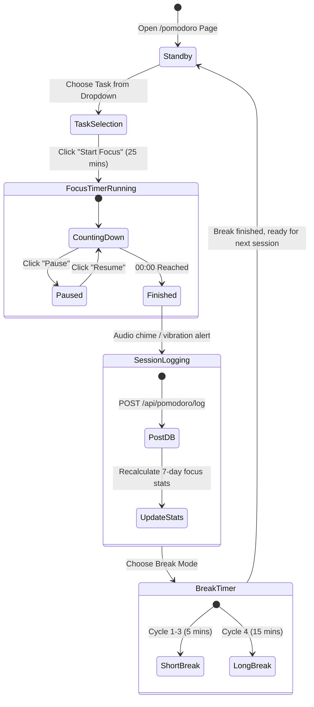
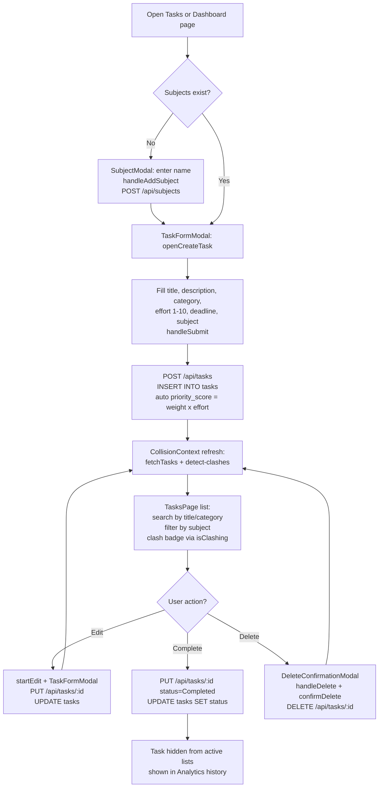
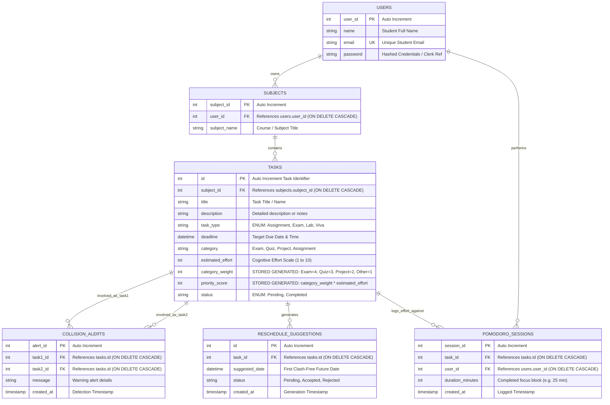
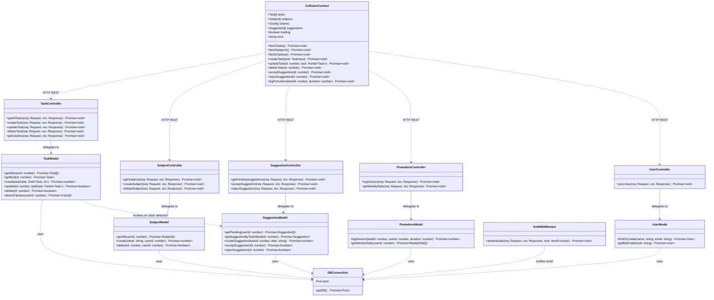
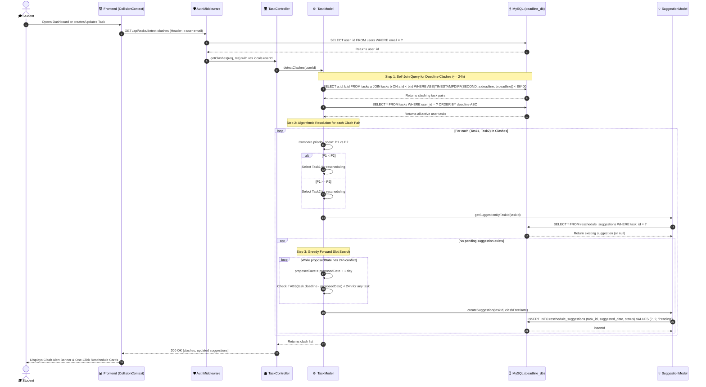
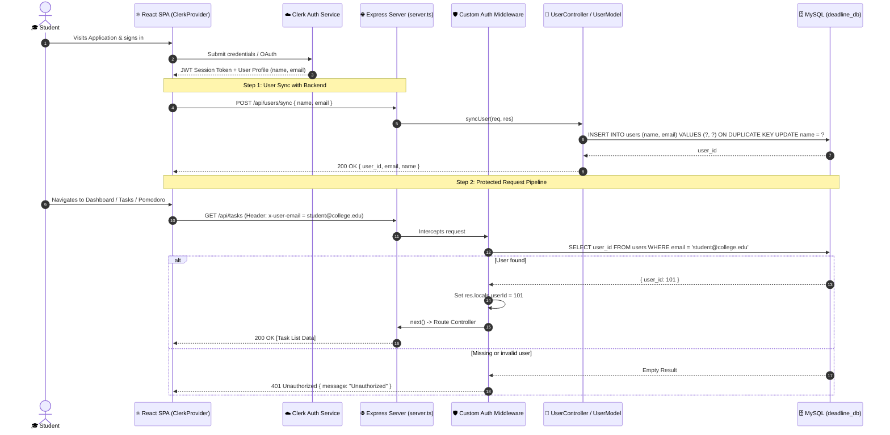
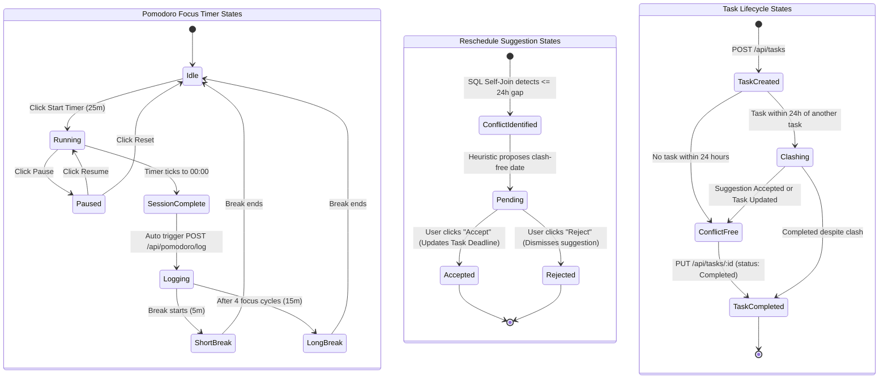

# 📚 StudySync

> An intelligent student productivity app — manage assignments, detect deadline collisions, get automated reschedule suggestions, and track study sessions with a built-in Pomodoro timer.

---

## Table of Contents

- [Literature Survey](#literature-survey)
- [Overview](#overview)
- [Features](#features)
- [System & User Workflows](#system--user-workflows)
  - [User Task Management Flow (CRUD Lifecycle)](#user-task-management-flow-crud-lifecycle)
- [High-Level Design (HLD)](#high-level-design-hld)
- [Low-Level Design (LLD)](#low-level-design-lld)
  - [1. Database Schema & Entity-Relationship Diagram (ERD)](#1-database-schema--entity-relationship-diagram-erd)
  - [2. Backend Class & Module Architecture](#2-backend-class--module-architecture)
  - [3. Sequence Diagram: Deadline Collision & Greedy Rescheduling](#3-sequence-diagram-deadline-collision--greedy-rescheduling)
  - [4. Sequence Diagram: Authentication & API Authorization](#4-sequence-diagram-authentication--api-authorization)
  - [5. System State Machines](#5-system-state-machines)
- [Tech Stack](#tech-stack)
- [Project Structure](#project-structure)
- [API Reference](#api-reference)
- [Use Cases](#use-cases)
- [Getting Started](#getting-started)
  - [Prerequisites](#prerequisites)
  - [Installation](#installation)
  - [Environment Variables](#environment-variables)
  - [Running the App](#running-the-app)
  - [Production Build](#production-build)
- [Authentication](#authentication)
- [Contributing](#contributing)

---

## Literature Survey

**Intelligent Academic Workload Balancing, Conflict Scheduling, and Focused Time Tracking**

> *Minor Project — Academic Documentation*

### 1. Introduction & Background Context

Higher education students routinely manage overlapping demands across multiple courses, including continuous assessments, laboratory evaluations, semester projects, quizzes, and end-term examinations. As academic workloads become increasingly decentralized across diverse Learning Management Systems (LMS) and communication channels, students face significant cognitive overload, suboptimal time allocation, and elevated stress levels.

Traditional productivity tools fall broadly into two categories:

- **Generic Task Management Applications** (e.g., Todoist, Notion, Trello), which lack academic context, treat all deadlines uniformly, and provide no automated collision detection.
- **Institutional Learning Management Systems** (e.g., Canvas, Moodle, Blackboard), which act as passive submission portals without cross-course conflict analysis, personal prioritization models, or focus-tracking capabilities.

**StudySync** bridges this gap by introducing an automated, academic-aware scheduling platform equipped with:

- **Relational Deadline Collision Detection** (≤ 24 hours thresholding via SQL self-joins)
- **Multicriteria Priority Computation** (`category_weight × estimated_effort`)
- **Automated Non-Conflicting Rescheduling via Greedy Heuristic Algorithm**
- **Integrated Pomodoro Time-Boxing with Analytics**

This survey provides a comprehensive review of existing literature, algorithmic paradigms, comparative analysis with commercial tools, and an identification of research gaps that justify the architecture of StudySync.

---

### 2. Theoretical Foundations

| Theory / Model | Proponents / Foundation | Relevance to StudySync |
|---|---|---|
| **Cognitive Load Theory (CLT)** | Sweller (1988), Paas et al. (2003) | When students manage multiple conflicting deadlines simultaneously, *extraneous cognitive load* spikes, impairing retention and task execution. Visual analytics and proactive clash alerts reduce extraneous processing. |
| **Temporal Motivation Theory (TMT)** | Steel (2007) | Perceived utility drops when deadlines are distant or vague. Automated priority scoring and relative countdown timers mitigate procrastination by increasing perceived urgency. |
| **Eisenhower Decision Matrix & MCDM** | Eisenhower (1954), Covey (1989) | Separates tasks along urgency and importance axes. StudySync operationalizes this into a deterministic numeric function: `Priority = f(Category Weight, Estimated Effort)`. |
| **Time-Boxing & Attention Restoration** | Cirillo (2006), Kaplan (1995) | The Pomodoro Technique segments sustained mental effort into 25-minute intervals with structured breaks, preventing cognitive fatigue and task abandonment. |

---

### 3. Thematic Literature Review

#### 3.1 Academic Task Scheduling & Resource-Constrained Project Scheduling (RCPSP)

In operations research and computer science, student workload management maps to the classical **Resource-Constrained Project Scheduling Problem (RCPSP)** (Brucker et al., 1999). A student represents a single resource with finite daily cognitive capacity measured in focused hours.

When multiple academic deliverables demand overlapping cognitive allocations within the same time window, conventional static calendars fail because they treat time purely as a container rather than a constrained cognitive resource (Bedworth & Bailey, 1982). Research demonstrates that uncoordinated deadline clustering leads to the *"student syndrome"* (Goldratt, 1997), where effort is postponed until the absolute temporal boundary, causing substandard work and academic burnout.

#### 3.2 Temporal Conflict & Collision Detection in Scheduling Systems

Collision detection has been widely studied in spatial computing and distributed workflow systems (Allen, 1983; Chittaro & Doerr, 2000). Allen's **Interval Temporal Logic** formalizes relationships between time intervals (e.g., *Before*, *Meets*, *Overlaps*, *During*, *Finishes*).

In academic workflows, deadlines are point timestamps, but the preparation interval is an extended prior envelope. A **temporal collision** occurs when two deadlines fall within a 24-hour window of each other. While enterprise project management systems (such as Jira or Microsoft Project) employ complex critical path methods (CPM) and PERT charts, these systems introduce high friction and are too cumbersome for undergraduate students. StudySync resolves this by embedding collision detection directly into the relational database layer via a high-performance **self-join query**:

```sql
SELECT t1.id, t2.id
FROM tasks t1, tasks t2
WHERE t1.id < t2.id
  AND ABS(TIMESTAMPDIFF(SECOND, t1.deadline, t2.deadline)) < 86400
  AND t1.user_id = t2.user_id
```

#### 3.3 Automated Task Prioritization & Multicriteria Decision Making (MCDM)

Traditional to-do applications rank tasks solely by deadline order or manual drag-and-drop flags. However, Keeney & Raiffa (1993) establish that single-variable utility functions fail when tasks differ fundamentally in academic consequence and effort intensity.

An exam worth 40% of a final grade requiring 10 hours of study cannot be equated with a routine homework assignment due on the same day. StudySync translates MCDM principles into an automated database-stored generated column:

| Category | Weight |
|---|:---:|
| Exam | 4 |
| Quiz | 3 |
| Project | 2 |
| Assignment / Lab / Viva | 1 |

```
Priority Score = Category Weight × Estimated Effort  (Effort ∈ [1, 10])
```

This ensures that the "Start This First" recommendation engine automatically elevates high-stakes, high-effort academic obligations over trivial tasks without requiring manual re-sorting by the student.

#### 3.4 Automated Rescheduling Algorithms

When a conflict is detected, resolving the collision requires determining:

1. **Which task to shift:** Retaining the higher priority task and adjusting the lower priority one.
2. **Where to shift:** Searching forward sequentially for the nearest collision-free day — the first future date where the rescheduled task has no deadline within 24 hours of any other task.

StudySync implements this as a **greedy forward-search heuristic** directly in the backend model layer. When a clash is identified, the system evaluates consecutive future dates beginning from the original deadline, checking each proposed date against all existing user tasks. The first date with no proximity conflicts is stored as an actionable reschedule suggestion in the `reschedule_suggestions` table, which the student can accept or reject with a single click.

#### 3.5 Pomodoro Technique & Attention Restoration in Digital Workspaces

Digital environments are characterized by frequent context-switching and digital distractions (Mark et al., 2008). Cirillo's Pomodoro Technique enforces focused cognitive bursts (typically 25 minutes) punctuated by short restorative breaks (5 minutes). Empirical research by Biwer et al. (2020) demonstrates that students who utilize structured time-boxing maintain higher self-regulation and report lower fatigue during intensive exam preparation.

Existing standalone timer apps (e.g., Forest, Pomofocus) operate in isolation from the student's task registry. StudySync closes this feedback loop by logging each timer session directly against a task ID, enabling rolling 7-day effort distributions per subject.

---

### 4. Comparative Analysis of Existing Systems

| Feature / Dimension | Google Calendar | Todoist | Notion / Trello | Canvas / Moodle LMS | MyStudyLife | **StudySync** |
|---|:---:|:---:|:---:|:---:|:---:|:---:|
| **Automated Deadline Collision Detection** | ❌ None | ❌ None | ❌ None | ❌ None | ⚠️ Manual overlap view | ✅ SQL Self-Join Alerting (≤ 24 h) |
| **Weighted Academic Priority Scoring** | ❌ None | ⚠️ Static tags (P1–P4) | ⚠️ Requires manual formula build | ❌ None | ❌ None | ✅ Automated (W_cat × Effort) |
| **Heuristic Reschedule Suggestions** | ❌ None | ❌ None | ❌ None | ❌ None | ❌ None | ✅ Greedy forward slot search |
| **Built-in Task-Linked Pomodoro Timer** | ❌ None | ❌ None | ❌ None | ❌ None | ❌ None | ✅ Integrated with per-task DB logging |
| **Weekly Study Analytics & Time Tracking** | ❌ None | ⚠️ Karma streaks only | ⚠️ Custom DB rollups | ⚠️ Course-level logins only | ❌ None | ✅ Rolling 7-day focused minutes aggregation |
| **Cross-Course Conflict Visualization** | ⚠️ Color blocks only | ❌ None | ⚠️ Custom views | ❌ Isolated by course | ⚠️ Timetable only | ✅ Clash Banners & Clashing Badges |

---

### 5. Critical Research & Industry Gaps

From the literature and market review, four primary gaps are identified:

1. **Gap 1 — Absence of Proactive Collision Detection:** Standard digital calendars treat deadlines as isolated calendar points. They do not calculate temporal density metrics to alert the user when two high-stakes deliverables occur within 24 hours of each other.
2. **Gap 2 — Superficial Task Prioritization:** Generic to-do lists treat all tasks equally or depend on manual P1–P4 tags, ignoring the actual academic weight (an exam vs. a homework) and required effort intensity.
3. **Gap 3 — Lack of Proactive Conflict Resolution:** When a clash occurs, conventional software places the entire rescheduling burden on the student. A well-designed system should automatically evaluate open time windows and present one-click actionable remedies.
4. **Gap 4 — Disconnected Task Registry and Execution Timer:** Students plan in one app (Todoist/Trello) and track time in another (Pomofocus/Forest). Study time metrics are never mapped back to academic deliverables, preventing reflection on actual vs. planned effort.

---

### 6. How StudySync Addresses These Gaps

1. **Database-Engineered Urgency (MySQL Generated Columns):** Category weights and composite priority scores are computed directly inside the relational schema (`STORED GENERATED ALWAYS AS`), eliminating sorting bottlenecks on the client.
2. **Deterministic Collision Detection:** A relational self-join query filtered by `ABS(TIMESTAMPDIFF(SECOND, a.deadline, b.deadline)) < 86400` automatically identifies conflicting task pairs for the authenticated user.
3. **Automated Non-Conflicting Slot Discovery:** When clashes are detected, the backend heuristic searches future calendar dates sequentially until a date with zero proximity conflicts is found, storing the result in `reschedule_suggestions`.
4. **Closed-Loop Pomodoro Logging:** Timer sessions write directly to `pomodoro_sessions(task_id, user_id, duration_minutes)`. The rolling 7-day aggregation enables immediate weekly focus audits per task and subject.
5. **High-Performance Client Architecture:** React 19 with route-level code-splitting (`React.lazy`), memoized calendar day lookups, and `useCallback`-stabilized context functions ensure zero UI lag.

---

### 7. Conclusion & Future Research Directions

This literature survey establishes that while digital task management is a mature market, intelligent domain-specific academic scheduling remains severely underserved. Traditional applications fail to mitigate cognitive overload because they lack automated deadline collision detection, structured priority scoring, and integrated focus analytics. StudySync synthesizes concepts from Operations Research, Cognitive Load Theory, Multicriteria Decision Making, and the Pomodoro Technique into a cohesive web application appropriate in scope for a minor project.

**Future research directions:**

1. **ML-Based Effort Prediction:** Dynamically adjusting `estimated_effort` based on a student's historical Pomodoro duration logs for similar course categories.
2. **Two-Way CalDAV / iCalendar Synchronization:** Bi-directional sync with Google Calendar, Apple Calendar, and Canvas iCal feeds to automatically import syllabus deadlines.
3. **Multi-User Collaborative Clash Detection:** Extending conflict queries across study groups or university cohorts to prevent scheduling clashes for collaborative team deliverables.
4. **Wearable Integration:** Correlating focus session completion rates with biometric markers (e.g., sleep quality from smartwatches) to optimize recommended daily study windows.

---

### 8. Academic References (IEEE Style)

1. J. Sweller, "Cognitive load during problem solving: Effects on learning," *Cognitive Science*, vol. 12, no. 2, pp. 257–285, 1988.
2. P. Steel, "The nature of procrastination: A meta-analytic and theoretical review of quintessential self-regulatory failure," *Psychological Bulletin*, vol. 133, no. 1, pp. 65–94, 2007.
3. P. Brucker, A. Drexl, R. Möhring, K. Neumann, and E. Pesch, "Resource-constrained project scheduling: Notation, classification, models, and methods," *European Journal of Operational Research*, vol. 112, no. 1, pp. 3–41, 1999.
4. J. F. Allen, "Maintaining knowledge about temporal intervals," *Communications of the ACM*, vol. 26, no. 11, pp. 832–843, 1983.
5. F. Cirillo, *The Pomodoro Technique: The Acclaimed Time-Management System That Has Transformed How We Work*, New York: Currency, 2006.
6. E. M. Goldratt, *Critical Chain*, Great Barrington, MA: North River Press, 1997.
7. T. L. Saaty, "What is the Analytic Hierarchy Process?," in *Mathematical Models for Decision Support*, Berlin, Heidelberg: Springer, 1988, pp. 109–121.
8. R. L. Keeney and H. Raiffa, *Decisions with Multiple Objectives: Preferences and Value Trade-Offs*, Cambridge University Press, 1993.
9. F. Biwer, M. G. A. de Bruin, E. Schreurs, and L. de Grave, "Fostering students' self-regulation in higher education: Evaluation of a time-management intervention," *Frontiers in Education*, vol. 5, p. 117, 2020.
10. G. Mark, D. Gudith, and U. Klocke, "The cost of interrupted work: More speed and stress," in *Proc. SIGCHI Conf. on Human Factors in Computing Systems (CHI 08)*, pp. 107–110, 2008.

---

## Overview

StudySync is a full-stack web application built for students to stay on top of their academic workload. It allows you to organise tasks by subject, spot deadline conflicts before they become a problem, and get automated reschedule suggestions powered by an algorithmic conflict-resolution heuristic. A built-in **Pomodoro timer** lets you log focused study sessions directly against tasks.

The app uses **Clerk** for authentication and a **MySQL** database to persist all data. The backend follows an **MVC (Model-View-Controller)** architecture served by an **Express** server, while the frontend is a **React 19 + Vite** single-page application styled with **Tailwind CSS**.

---

## Features

| Feature | Description |
|---|---|
| 🗂️ **Task Management** | Create, edit, delete and filter tasks by subject, type (`Assignment`, `Exam`, `Lab`, `Viva`), and category. |
| ⚠️ **Deadline Collision Detection** | Automatically detects pairs of tasks whose deadlines fall within 24 hours of each other and raises alerts. |
| 💡 **Smart Reschedule Suggestions** | Evaluates priority scores and searches for the nearest non-conflicting time slots for clashing tasks. Accept or reject them with one click. |
| 📅 **Calendar View** | Visualises all upcoming deadlines on an interactive monthly calendar. |
| 📊 **Analytics Dashboard** | Breaks down your tasks by category and priority score (Critical / Moderate / Routine) with visual bar charts. |
| ⏱️ **Pomodoro Timer** | Configurable focus / short-break / long-break timer with automatic session logging per task. |
| 🌙 **Dark Mode** | System-aware dark/light theme with manual toggle. |
| 🔐 **Authentication** | Secure sign-in/sign-up via Clerk. All API endpoints are protected by a custom email-based auth middleware. |

---

## System & User Workflows

> For the raw `.mmd` diagrams and stage matrices, see [WORKFLOW.md](WORKFLOW.md) and [HLD_LLD.md](HLD_LLD.md).

### 1. End-to-End Operational Workflow

```mermaid
flowchart TD
    subgraph Phase1 ["1. Authentication & Onboarding"]
        Start(["🎓 Student Visits App"]) --> Login{"Authenticated via Clerk?"}
        Login -- No --> ClerkAuth["Clerk Sign In / Sign Up (OAuth / Email)"]
        ClerkAuth --> SyncUser["POST /api/users/sync\n(Upsert Student in MySQL users)"]
        Login -- Yes --> SessionReady["Session Active (JWT Stored)"]
        SyncUser --> SessionReady
    end

    subgraph Phase2 ["2. Academic Setup & Task Registration"]
        SessionReady --> InitDashboard["Navigate to Dashboard"]
        InitDashboard --> CheckSubjects{"Subjects exist?"}
        CheckSubjects -- No --> CreateSubject["Create Subject Modal\nPOST /api/subjects"]
        CreateSubject --> CreateTask["Create Task Modal\nPOST /api/tasks"]
        CheckSubjects -- Yes --> CreateTask

        CreateTask --> InputDetails["Student Enters:\n• Title & Description\n• Category (Exam, Quiz, Project, Assignment)\n• Estimated Effort (Scale 1 to 10)\n• Deadline Timestamp\n• Subject Association"]
    end

    subgraph Phase3 ["3. Automated Prioritization & Collision Detection"]
        InputDetails --> DBSave["MySQL INSERT into tasks table"]
        DBSave --> AutoCompute["MySQL STORED GENERATED Columns Auto-Calculate:\n• category_weight = (Exam:4, Quiz:3, Project:2, Other:1)\n• priority_score = category_weight * estimated_effort"]
        
        AutoCompute --> TriggerClash["Trigger Collision Check\nGET /api/tasks/detect-clashes"]
        TriggerClash --> SelfJoin["Execute SQL Self-Join Query:\nABS(TIMESTAMPDIFF(SECOND, t1.deadline, t2.deadline)) < 86400"]
        
        SelfJoin --> HasClash{"Clashes Found\n(|d1 - d2| <= 24h)?"}
    end

    subgraph Phase4 ["4. Conflict Resolution & Rescheduling"]
        HasClash -- No --> SafeStatus["Mark Tasks as Normal / Conflict-Free"]
        
        HasClash -- Yes --> ComparePriority["Evaluate Clash Pair (Task A vs Task B)\nCompare Priority Scores: Pa vs Pb"]
        ComparePriority --> PickTask["Select Lower Priority Task for Rescheduling\n(Higher priority task retains original deadline)"]
        
        PickTask --> ForwardSearch["Greedy Forward Slot Search:\n1. proposedDate = originalDeadline + 1 day\n2. Check proximity with all existing user tasks\n3. If within 24h of any task, increment day & retry\n4. Terminate when conflict-free date is found"]
        
        ForwardSearch --> SaveSuggestion["INSERT into reschedule_suggestions\n(status: 'Pending')"]
        SaveSuggestion --> DisplayAlert["Frontend Displays:\n• Red Clash Banner\n• Clashing Badge on Task Cards\n• One-Click Action Recommendation Card"]
        
        DisplayAlert --> UserDecision{"Student Choice"}
        UserDecision -- "Click Accept" --> ApplySuggestion["POST /api/suggestions/:id/accept\n• UPDATE tasks.deadline = suggested_date\n• UPDATE suggestions.status = 'Accepted'"]
        UserDecision -- "Click Reject" --> DismissSuggestion["POST /api/suggestions/:id/reject\n• UPDATE suggestions.status = 'Rejected'\n• Retain current deadline"]
        
        ApplySuggestion --> RecheckClash["Re-run Clash Detection\n(Clash cleared)"]
        DismissSuggestion --> SafeStatus
        RecheckClash --> SafeStatus
    end

    subgraph Phase5 ["5. Execution & Focused Study Tracking"]
        SafeStatus --> ChooseExecution{"Student Activity"}
        
        ChooseExecution --> ViewSchedule["Review Schedule on\nCalendar View / Task List"]
        ChooseExecution --> StartStudy["Navigate to Pomodoro Timer (/pomodoro)"]
        
        StartStudy --> SelectTask["Select Academic Task to Work On"]
        SelectTask --> TimerRun["Start 25-minute Focus Session"]
        
        TimerRun --> TimerPause{"Paused?"}
        TimerPause -- Yes --> TimerResume["Resume when ready"]
        TimerResume --> TimerRun
        TimerPause -- No --> TimerComplete["Timer Reaches 00:00"]
        
        TimerComplete --> LogSession["Auto-POST /api/pomodoro/log\n(task_id, user_id, duration_minutes: 25)"]
        LogSession --> BreakPrompt["5-minute Rest Break\n(15-minute after 4 cycles)"]
        BreakPrompt --> NextSession{"Continue Studying?"}
        NextSession -- Yes --> SelectTask
        NextSession -- No --> ReviewAnalytics["Navigate to Analytics (/analytics)"]
    end

    subgraph Phase6 ["6. Performance Review & Completion"]
        ReviewAnalytics --> ViewStats["View Interactive Dashboards:\n• Rolling 7-day study minutes per task\n• Workload distribution by subject & category\n• Priority distribution (Critical / Moderate / Routine)"]
        
        ViewStats --> CompleteTask["Mark Task Complete\nPUT /api/tasks/:id (status: 'Completed')"]
        CompleteTask --> EndState(["🏁 Academic Goal Achieved"])
    end
```



---

### 2. Algorithmic Conflict Resolution Workflow



---

### 3. Pomodoro Focus Execution Loop



---

### User Task Management Flow (CRUD Lifecycle)

This flow covers the day-to-day task loop from the student's perspective: create a subject once, then create, view, filter, edit, complete, and delete tasks. It is implemented by `TasksPage.tsx` + `DashboardPage.tsx` (views), `CollisionContext.tsx` (`openCreateTask`, `startEdit`, `handleSubmit`, `handleDelete`/`confirmDelete`, `isClashing`), `TaskFormModal` / `SubjectModal` / `DeleteConfirmationModal` / `TaskCard` (components), `taskController.ts` + `taskModel.ts` (backend), and the `tasks` table (MySQL generated `priority_score`).



| Action | UI Trigger | Context Method | API Endpoint | Database Effect |
|---|---|---|---|---|
| Create subject | `SubjectModal` | `handleAddSubject` | `POST /api/subjects` | `INSERT INTO subjects` |
| Create task | `TaskFormModal` | `openCreateTask` → `handleSubmit` | `POST /api/tasks` | `INSERT INTO tasks` (auto-computes `category_weight`, `priority_score`) |
| View / search / filter | `TasksPage` search bar + subject dropdown | `tasks`, `isClashing(task.id)` | `GET /api/tasks` + `GET /api/tasks/detect-clashes` | `SELECT` ordered by `deadline ASC`, clash badge if within 24h |
| Edit task | Edit button on `TaskCard` row | `startEdit(task)` → `handleSubmit` | `PUT /api/tasks/:id` | `UPDATE tasks SET ... WHERE id = ?` (re-triggers clash check) |
| Complete task | Mark-complete action | `handleSubmit` with `status: Completed` | `PUT /api/tasks/:id` | `UPDATE tasks SET status = 'Completed'` |
| Delete task | Delete button → confirm dialog | `handleDelete` → `confirmDelete` | `DELETE /api/tasks/:id` | `DELETE FROM tasks WHERE id = ?` (cascades suggestions/alerts) |

**Steps:**
1. **Setup (one-time):** create a subject (e.g. Operating Systems) via `SubjectModal` if none exists.
2. **Create:** open `TaskFormModal` (`openCreateTask`), enter title, category (`Exam`/`Quiz`/`Project`/`Assignment`), effort (1–10), deadline, and subject; `handleSubmit` fires `POST /api/tasks`.
3. **Auto-prioritize:** MySQL `STORED GENERATED` columns compute `category_weight` (Exam=4, Quiz=3, Project=2, other=1) and `priority_score = category_weight × estimated_effort`; context re-fetches tasks and clashes.
4. **View:** `TasksPage` lists tasks with subject chip, category chip, `Score`, formatted deadline, and a red `Clash` badge when `isClashing()` is true; search filters by title/category, dropdown filters by subject.
5. **Update:** edit re-opens the modal (`startEdit` → `PUT`), complete flips `status` to `Completed`, delete goes through `DeleteConfirmationModal` (`DELETE`).
6. **Loop:** every create/update/delete refreshes `CollisionContext`, so clash banners, calendar, and analytics stay in sync without a page reload.

---

## High-Level Design (HLD)

The High-Level Design defines the 4-tier architecture of StudySync:
- **Presentation Tier:** React 19 Single-Page Application (SPA) with route-level code splitting (`React.lazy`), memoized context state (`CollisionContext`), and Neo-Brutalist styling.
- **Identity Tier:** Clerk Cloud Authentication handling identity verification, user sessions, and JWT tokens.
- **Application Tier:** Express 4 REST API in TypeScript utilizing the Model-View-Controller (MVC) pattern, featuring custom email-based authorization middleware, SQL self-join clash detection, and a greedy heuristic forward-search rescheduler.
- **Persistence Tier:** MySQL 8.0 with foreign key cascade guarantees, connection pooling (`mysql2/promise`), and schema-level generated columns for urgency computation.

### 4-Tier System Architecture

```mermaid
flowchart TB
    %% Presentation Layer
    subgraph FrontendTier ["🎨 1. Presentation Tier (React 19 + Vite 6 + Tailwind CSS)"]
        User(["🎓 Student User"])

        subgraph ClientAuth ["Auth & Session Management"]
            ClerkReact["Clerk React Provider\n(<ClerkProvider>, useUser, useAuth)"]
            TokenStorage["Session JWT & Email State\n(x-user-email Header Injection)"]
        end

        subgraph StateManagement ["Context & Cache Layer"]
            CollisionContext["CollisionContext\n• tasks: Task[]\n• subjects: Subject[]\n• clashes: Clash[]\n• suggestions: Suggestion[]\n• memoized actions (useCallback)"]
        end

        subgraph PageRoutes ["Client-Side Routing (React Router DOM v7)"]
            RouteDashboard["/ (DashboardPage)\n• SectionStat metrics\n• Clash Alert Banner\n• RecommendationCard\n• TaskCard grid"]
            RouteTasks["/tasks (TasksPage)\n• Filter by Subject & Type\n• Search & Sort\n• Modals: Add, Edit, Delete"]
            RouteCalendar["/calendar (CalendarPage)\n• Precomputed tasksByDay Map\n• Monthly interactive grid"]
            RouteAnalytics["/analytics (AnalyticsPage)\n• Category Breakdown\n• Priority Distribution\n• Pomodoro Rolling 7-Day"]
            RoutePomodoro["/pomodoro (PomodoroPage)\n• 25m Focus / 5m Break / 15m Long\n• Task Association & DB Session Log"]
        end

        subgraph ReusableComponents ["Modular UI Components"]
            CompTaskCard["TaskCard.tsx"]
            CompTaskModal["TaskFormModal.tsx"]
            CompSubjectModal["SubjectModal.tsx"]
            CompDeleteModal["DeleteConfirmationModal.tsx"]
            CompSectionStat["SectionStat.tsx"]
            CompNavbar["Navbar.tsx (Responsive Nav)"]
            CompThemeToggle["ThemeToggle.tsx (Dark/Light)"]
        end
    end

    %% External Identity
    subgraph ExternalServices ["☁️ 2. External Services Tier"]
        ClerkCloud["Clerk Identity Platform\n• User Authentication & OAuth\n• Session Token Issuance"]
    end

    %% Application Layer
    subgraph BackendTier ["⚙️ 3. Application Tier (Express 4 + TypeScript + Node.js)"]
        ServerCore["server.ts\n• HTTP Server Listener (:3000)\n• Vite Dev HMR / Prod Static Dist"]

        subgraph MiddlewarePipeline ["HTTP Middleware Chain"]
            MW_CORS["CORS Middleware"]
            MW_JSON["express.json() Body Parser"]
            MW_Auth["Custom Auth Middleware\n• Validates x-user-email\n• Queries users table\n• Injects res.locals.userId"]
        end

        subgraph RouterLayer ["Express API Routers"]
            RouterTasks["/api/tasks (taskRoutes.ts)"]
            RouterSubjects["/api/subjects (subjectRoutes.ts)"]
            RouterSuggestions["/api/suggestions (suggestionRoutes.ts)"]
            RouterPomodoro["/api/pomodoro (pomodoroRoutes.ts)"]
            RouterUsers["/api/users (userRoutes.ts)"]
        end

        subgraph ControllerLayer ["Controllers (Request Orchestration)"]
            CtrlTask["taskController.ts\n• getAllTasks, createTask\n• updateTask, deleteTask\n• getClashes"]
            CtrlSubject["subjectController.ts\n• getSubjects, createSubject, deleteSubject"]
            CtrlSuggestion["suggestionController.ts\n• getPendingSuggestions\n• acceptSuggestion, rejectSuggestion"]
            CtrlPomodoro["pomodoroController.ts\n• logSession, getWeeklyStats"]
            CtrlUser["userController.ts\n• syncUser (Upsert)"]
        end

        subgraph AlgorithmicEngines ["Algorithmic & Heuristic Engine"]
            EngineClash["Self-Join Collision Engine\n• Window: ABS(diff(d1, d2)) < 86400s\n• Cross-subject detection"]
            EnginePriority["Academic Prioritization Evaluator\n• Exam=4, Quiz=3, Project=2, Other=1\n• Priority = CategoryWeight * Effort"]
            EngineReschedule["Greedy Forward Slot Search\n• Loops proposedDate = deadline + 1 day\n• Validates no conflict (|diff| < 24h)\n• Emits pending suggestion"]
        end

        subgraph ModelLayer ["Data Access Layer (Models - raw SQL)"]
            ModelTask["TaskModel.ts"]
            ModelSubject["SubjectModel.ts"]
            ModelSuggestion["SuggestionModel.ts"]
            ModelPomodoro["PomodoroModel.ts"]
            ModelUser["UserModel.ts"]
        end
    end

    %% Persistence Layer
    subgraph DatabaseTier ["🗄️ 4. Persistence Tier (MySQL 8.0 - deadline_db)"]
        DBPool["mysql2 Connection Pool (config/db.ts)"]

        subgraph DatabaseSchema ["Relational Schema & Constraints"]
            T_Users[("users\n• user_id (PK)\n• email (UK)\n• name, password")]
            T_Subjects[("subjects\n• subject_id (PK)\n• user_id (FK -> users)\n• subject_name")]
            T_Tasks[("tasks\n• id (PK)\n• subject_id (FK -> subjects)\n• title, description, deadline\n• category, estimated_effort (1-10)\n• category_weight (STORED GENERATED)\n• priority_score (STORED GENERATED)\n• status (Pending, Completed)")]
            T_Alerts[("collision_alerts\n• alert_id (PK)\n• task1_id, task2_id (FK -> tasks)\n• message, created_at")]
            T_Suggestions[("reschedule_suggestions\n• id (PK)\n• task_id (FK -> tasks)\n• suggested_date\n• status (Pending, Accepted, Rejected)")]
            T_Pomodoro[("pomodoro_sessions\n• session_id (PK)\n• task_id (FK -> tasks)\n• user_id (FK -> users)\n• duration_minutes, created_at")]
        end
    end

    %% Wiring
    User -->|"Interacts with Views"| PageRoutes
    PageRoutes --> ReusableComponents
    PageRoutes --> CollisionContext
    
    User -->|"Signs in / Signs up"| ClerkReact
    ClerkReact <-->|"OAuth2 / OIDC Token Exchange"| ClerkCloud
    ClerkReact --> TokenStorage

    CollisionContext -->|"Async Fetch with x-user-email"| ServerCore
    ServerCore --> MW_CORS --> MW_JSON --> MW_Auth

    MW_Auth -->|"Verifies email & extracts user_id"| T_Users
    MW_Auth --> RouterLayer

    RouterTasks --> CtrlTask
    RouterSubjects --> CtrlSubject
    RouterSuggestions --> CtrlSuggestion
    RouterPomodoro --> CtrlPomodoro
    RouterUsers --> CtrlUser

    CtrlTask --> ModelTask
    CtrlSubject --> ModelSubject
    CtrlSuggestion --> ModelSuggestion
    CtrlPomodoro --> ModelPomodoro
    CtrlUser --> ModelUser

    ModelTask --> EngineClash
    EngineClash --> EnginePriority
    EnginePriority --> EngineReschedule
    EngineReschedule --> ModelSuggestion

    ModelTask --> DBPool
    ModelSubject --> DBPool
    ModelSuggestion --> DBPool
    ModelPomodoro --> DBPool
    ModelUser --> DBPool

    DBPool --> DatabaseSchema

    %% DB Cascades
    T_Users -->|"1 : N (CASCADE)"| T_Subjects
    T_Subjects -->|"1 : N (CASCADE)"| T_Tasks
    T_Tasks -->|"1 : N (CASCADE)"| T_Alerts
    T_Tasks -->|"1 : N (CASCADE)"| T_Suggestions
    T_Tasks -->|"1 : N (CASCADE)"| T_Pomodoro
    T_Users -->|"1 : N (CASCADE)"| T_Pomodoro
```



---

## Low-Level Design (LLD)

### 1. Database Schema & Entity-Relationship Diagram (ERD)

The relational schema implements clean normalization with referential integrity rules (`ON DELETE CASCADE`) and schema-generated fields:



#### Key Database Design Decisions:
- **`tasks.priority_score`** — a MySQL **generated stored column** that multiplies a `category_weight` by `estimated_effort` (1–10 scale), so sorting by urgency requires zero application logic overhead.
- **`tasks.category_weight`** — generated column: `Exam=4`, `Quiz=3`, `Project=2`, `Assignment/other=1`.
- **Collision detection** — performed via a self-join query on the `tasks` table, finding pairs where `ABS(TIMESTAMPDIFF(SECOND, a.deadline, b.deadline)) < 86400`.
- **Cascade deletes** — deleting a user cascades to their subjects → tasks → alerts/suggestions/pomodoro_sessions, keeping the database clean.

Initialize the database by running `schema.sql` against your MySQL server:
```bash
mysql -u root -p < schema.sql
```

---

### 2. Backend Class & Module Architecture

The backend strictly adheres to the MVC separation of concerns:
- **Controllers** handle HTTP requests, input validation, and HTTP response codes.
- **Models** contain raw parameterized SQL queries via `mysql2/promise`.
- **Middlewares** authenticate requests and inject user context into `res.locals`.



---

### 3. Sequence Diagram: Deadline Collision & Greedy Rescheduling

This diagram outlines the complete sequence triggered whenever tasks are refreshed or created:



---

### 4. Sequence Diagram: Authentication & API Authorization



---

### 5. System State Machines



---

## Tech Stack

### Frontend
| Library | Purpose |
|---|---|
| [React 19](https://react.dev/) | UI framework |
| [React Router DOM v7](https://reactrouter.com/) | Client-side routing |
| [Vite 6](https://vite.dev/) | Build tool & dev server |
| [Tailwind CSS v4](https://tailwindcss.com/) | Utility-first styling |
| [Clerk React](https://clerk.com/docs/references/react/overview) | Authentication UI & session management |
| [Motion (Framer Motion)](https://motion.dev/) | Animations |
| [Lucide React](https://lucide.dev/) | Icon set |
| [date-fns](https://date-fns.org/) | Date formatting utilities |

### Backend
| Library | Purpose |
|---|---|
| [Express 4](https://expressjs.com/) | HTTP server & routing |
| [mysql2](https://github.com/sidorares/node-mysql2) | MySQL client with promise support |
| [dotenv](https://github.com/motdotla/dotenv) | Environment variable loading |
| [cors](https://github.com/expressjs/cors) | Cross-Origin Resource Sharing |
| [tsx](https://github.com/privatenumber/tsx) | TypeScript execution for Node.js |

### Language & Tooling
- **TypeScript 5.8** — end-to-end type safety
- **MySQL** — relational database

---

## Project Structure

```
StudySync/
├── server.ts               # Express entry point — mounts middleware, routes, and Vite dev server
├── vite.config.ts          # Vite build configuration (React plugin, Tailwind, path aliases)
├── tsconfig.json           # TypeScript configuration
├── schema.sql              # Database DDL — tables, generated columns, collision query
├── .env.example            # Template for required environment variables
│
├── config/
│   └── db.ts               # MySQL connection pool factory
│
├── models/                 # Data access layer (raw SQL queries)
│   ├── taskModel.ts        # CRUD + deadline clash detection & heuristic rescheduling
│   ├── subjectModel.ts     # Subject CRUD
│   ├── userModel.ts        # User lookup / upsert
│   ├── pomodoroModel.ts    # Pomodoro session logging & weekly stats
│   ├── alertModel.ts       # Collision alert persistence
│   └── suggestionModel.ts  # Reschedule suggestion CRUD
│
├── controllers/            # Request handlers (MVC controllers)
│   ├── taskController.ts
│   ├── subjectController.ts
│   ├── suggestionController.ts
│   └── pomodoroController.ts
│
├── routes/                 # Express routers
│   ├── taskRoutes.ts
│   ├── subjectRoutes.ts
│   ├── userRoutes.ts
│   ├── suggestionRoutes.ts
│   └── pomodoroRoutes.ts
│
└── src/                    # React frontend (SPA)
    ├── main.tsx            # App entry — wraps with ClerkProvider & ThemeProvider
    ├── App.tsx             # Route definitions with lazy loading & Suspense
    ├── types.ts            # Shared TypeScript types
    │
    ├── pages/
    │   ├── DashboardPage.tsx   # Overview stats, task list, collision alerts, suggestions
    │   ├── TasksPage.tsx       # Full task list with filters and CRUD
    │   ├── CalendarPage.tsx    # Monthly calendar view of deadlines
    │   ├── AnalyticsPage.tsx   # Category & priority breakdown charts
    │   ├── PomodoroPage.tsx    # Pomodoro timer with session logging
    │   └── LoginPage.tsx       # Clerk sign-in/sign-up landing
    │
    ├── contexts/
    │   └── CollisionContext.tsx # Global data provider — tasks, subjects, clashes, suggestions
    │
    ├── components/
    │   ├── common/
    │   │   ├── Navbar.tsx       # Shared navigation bar
    │   │   └── ThemeToggle.tsx  # Dark/light mode switcher
    │   ├── dashboard/
    │   │   └── SectionStat.tsx  # Metric card component
    │   └── tasks/
    │       ├── TaskCard.tsx               # Task display card
    │       ├── TaskFormModal.tsx          # Task creation/editing dialog
    │       ├── RecommendationCard.tsx     # High priority recommendation
    │       ├── SubjectModal.tsx           # Subject management dialog
    │       └── DeleteConfirmationModal.tsx # Delete confirmation dialog
    │
    ├── hooks/              # Custom React hooks
    ├── providers/          # ThemeProvider (dark/light mode)
    ├── types/              # Additional TypeScript type definitions
    └── utils/              # Shared utility functions
```

---

---

## API Reference

All routes are prefixed with `/api`. Every route (except `/api/users/sync` and `/api/health`) requires the `x-user-email` request header for authentication.

### Health
| Method | Endpoint | Description |
|---|---|---|
| `GET` | `/api/health` | Returns `{ status: "ok" }` |

### Users
| Method | Endpoint | Description |
|---|---|---|
| `POST` | `/api/users/sync` | Upsert a Clerk user into the database |

### Subjects
| Method | Endpoint | Description |
|---|---|---|
| `GET` | `/api/subjects` | List all subjects for the authenticated user |
| `POST` | `/api/subjects` | Create a new subject |
| `DELETE` | `/api/subjects/:id` | Delete a subject (cascades to its tasks) |

### Tasks
| Method | Endpoint | Description |
|---|---|---|
| `GET` | `/api/tasks` | List all tasks for the authenticated user |
| `POST` | `/api/tasks` | Create a new task |
| `PUT` | `/api/tasks/:id` | Update a task |
| `DELETE` | `/api/tasks/:id` | Delete a task |
| `GET` | `/api/tasks/detect-clashes` | Detect and log deadline collisions & generate suggestions |

### Reschedule Suggestions
| Method | Endpoint | Description |
|---|---|---|
| `GET` | `/api/suggestions` | List pending reschedule suggestions |
| `POST` | `/api/suggestions/:id/accept` | Accept a suggestion (updates the task deadline) |
| `POST` | `/api/suggestions/:id/reject` | Reject a suggestion |

### Pomodoro
| Method | Endpoint | Description |
|---|---|---|
| `POST` | `/api/pomodoro/log` | Log a completed Pomodoro session for a task |
| `GET` | `/api/pomodoro/weekly-stats` | Retrieve weekly study-time statistics |

---

## Use Cases

Actor: **Student** (authenticated via Clerk; `x-user-email` on all protected routes).

| ID | Use Case | Description | Primary Flow |
|---|---|---|---|
| UC-01 | Sign up / Sign in | Create account or log in, sync to DB | Clerk auth → `POST /api/users/sync` → `INSERT INTO users ... ON DUPLICATE KEY UPDATE` |
| UC-02 | Manage subjects | Group tasks by course | `SubjectModal` → `POST /api/subjects` / `DELETE /api/subjects/:id` |
| UC-03 | Create task | Add assignment/exam/lab/viva with deadline, category, effort 1–10 | `TaskFormModal` (`openCreateTask` → `handleSubmit`) → `POST /api/tasks` → `INSERT INTO tasks` (auto `priority_score = category_weight × effort`) |
| UC-04 | View / search / filter tasks | Browse deadlines, find work fast | `TasksPage` search (title/category) + subject dropdown → `GET /api/tasks`; clash badge via `isClashing()` + `GET /api/tasks/detect-clashes` |
| UC-05 | Edit task | Change title, deadline, category, effort, subject | Edit button (`startEdit`) → `PUT /api/tasks/:id` → `UPDATE tasks` (re-triggers clash check) |
| UC-06 | Complete task | Mark work done | Mark-complete → `PUT /api/tasks/:id { status: Completed }` |
| UC-07 | Delete task | Remove unwanted task | Delete button → `DeleteConfirmationModal` (`handleDelete` → `confirmDelete`) → `DELETE /api/tasks/:id` |
| UC-08 | Detect deadline collisions | Spot tasks due within 24h of each other | `GET /api/tasks/detect-clashes` (SQL self-join `ABS(TIMESTAMPDIFF(SECOND, d1, d2)) < 86400`) → clash banner on Dashboard |
| UC-09 | Accept / reject reschedule suggestion | Resolve a clash in one click | `RecommendationCard` → `POST /api/suggestions/:id/accept` (`UPDATE tasks.deadline`) or `/reject` |
| UC-10 | View calendar | See deadlines on monthly grid | `CalendarPage` (precomputed `tasksByDay` map) → `GET /api/tasks` |
| UC-11 | Focus with Pomodoro timer | Log 25m focus / 5m break / 15m long break against a task | `PomodoroPage` → `POST /api/pomodoro/log` → `INSERT INTO pomodoro_sessions` |
| UC-12 | Review analytics | Audit effort by category, priority, 7-day focus | `AnalyticsPage` → `GET /api/pomodoro/weekly-stats` + `GET /api/tasks` |

---

## Getting Started

### Prerequisites

- **Node.js** >= 18
- **MySQL** >= 8.0 running locally (or a remote instance)
- A **Clerk** account and application — [clerk.com](https://clerk.com)

### Installation

```bash
# Clone the repository
git clone https://github.com/your-username/StudySync.git
cd StudySync

# Install all dependencies
npm install
```

### Environment Variables

Copy `.env.example` to `.env` and fill in your values:

```bash
cp .env.example .env
```

```dotenv
# MySQL Database Configuration
DB_HOST=localhost
DB_USER=root
DB_PASSWORD=your_mysql_password
DB_NAME=deadline_db

# App Configuration
PORT=3000

# Clerk Authentication (used client-side via Vite)
VITE_CLERK_PUBLISHABLE_KEY=pk_test_...
```

> **Note:** `VITE_*` prefixed variables are injected into the frontend bundle by Vite. Keep your Clerk **secret key** out of the frontend; it is not required here since the backend uses email-based auth.

### Running the App

```bash
# Start the development server (Express + Vite HMR on the same port)
npm run dev
```

The app will be available at **http://localhost:3000**.

The Express server serves the Vite dev middleware in development, so a single `npm run dev` command boots both the backend API and the React frontend with Hot Module Replacement.

### Production Build

```bash
# 1. Build the React frontend
npm run build

# 2. Start the Express server in production mode
NODE_ENV=production npm run dev
```

In production mode, the server serves the compiled assets from the `dist/` folder instead of running Vite middleware.

---

## Authentication

StudySync uses **Clerk** for identity management:

1. The React app wraps everything in `<ClerkProvider>`.
2. After sign-in, the frontend calls `POST /api/users/sync` to upsert the Clerk user (name + email) into the MySQL `users` table.
3. Every subsequent API request includes the `x-user-email` header, which the Express auth middleware uses to resolve a `userId` and attach it to `res.locals` for downstream controllers.

---

## Contributing

1. Fork the repository.
2. Create a feature branch: `git checkout -b feature/your-feature`
3. Commit your changes: `git commit -m "feat: add your feature"`
4. Push and open a Pull Request.

Please follow the existing TypeScript & ESLint conventions and keep the MVC layer separation intact (models handle SQL, controllers handle HTTP concerns).

---
