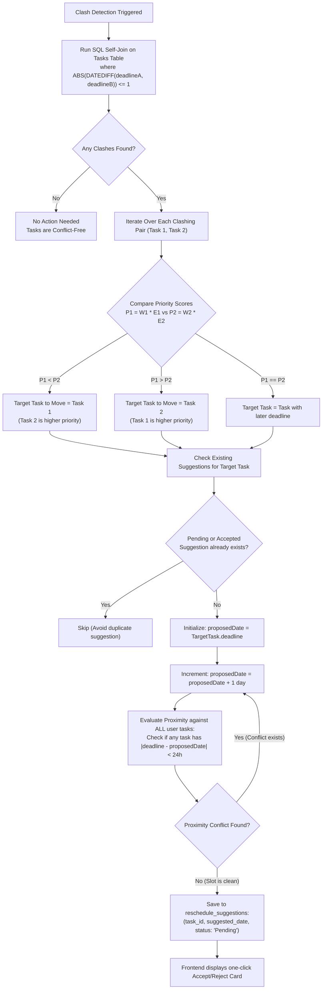
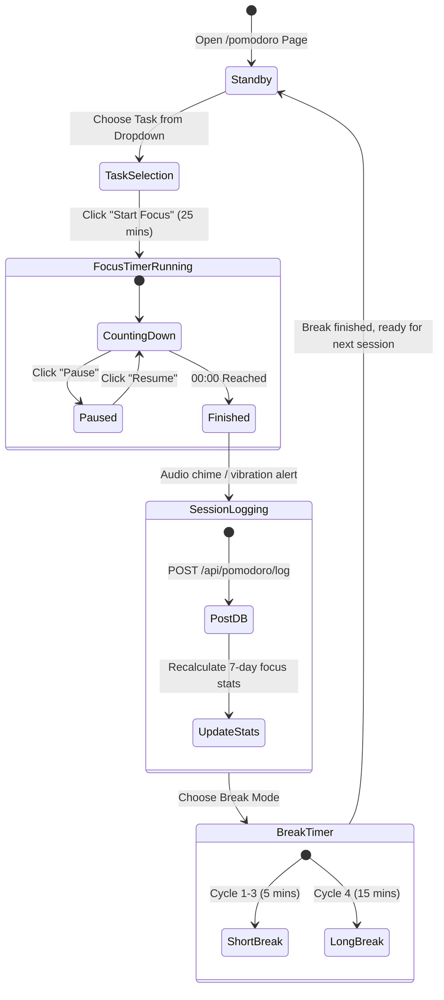

# 🔄 StudySync: System & User Workflow Documentation

This document describes the complete operational and algorithmic workflows of the **StudySync** application, covering user onboarding, task management, collision detection, automated heuristic rescheduling, focused execution with Pomodoro, and analytics reporting.

---

## 1. End-to-End Operational Workflow Diagram

```mermaid
flowchart TD
    %% =========================================================================
    %% STUDY SYNC - END-TO-END WORKFLOW DIAGRAM
    %% =========================================================================

    subgraph Phase1 ["1. Authentication & Onboarding"]
        Start(["🎓 Student Visits App"]) --> Login{"Authenticated via Clerk?"}
        Login -- No --> ClerkAuth["Clerk Sign In / Sign Up (OAuth / Email)"]
        ClerkAuth --> SyncUser["POST /api/users/sync\n(Upsert Student in MySQL users)"]
        Login -- Yes --> SessionReady["Session Active (JWT Stored)"]
        SyncUser --> SessionReady
    end

    subgraph Phase2 ["2. Academic Setup & Task Registration"]
        SessionReady --> InitDashboard["Navigate to Dashboard"]
        InitDashboard --> CheckSubjects{"Subjects exist?"}
        CheckSubjects -- No --> CreateSubject["Create Subject Modal\nPOST /api/subjects (e.g. Operating Systems)"]
        CreateSubject --> CreateTask["Create Task Modal\nPOST /api/tasks"]
        CheckSubjects -- Yes --> CreateTask

        CreateTask --> InputDetails["Student Enters:\n• Title & Description\n• Category (Exam, Quiz, Project, Assignment)\n• Estimated Effort (Scale 1 to 10)\n• Deadline Timestamp\n• Subject Association"]
    end

    subgraph Phase3 ["3. Automated Prioritization & Collision Detection"]
        InputDetails --> DBSave["MySQL INSERT into tasks table"]
        DBSave --> AutoCompute["MySQL STORED GENERATED Columns Auto-Calculate:\n• category_weight = (Exam:4, Quiz:3, Project:2, Other:1)\n• priority_score = category_weight * estimated_effort"]
        
        AutoCompute --> TriggerClash["Trigger Collision Check\nGET /api/tasks/detect-clashes"]
        TriggerClash --> SelfJoin["Execute SQL Self-Join Query:\nABS(TIMESTAMPDIFF(SECOND, t1.deadline, t2.deadline)) < 86400"]
        
        SelfJoin --> HasClash{"Clashes Found\n(|d1 - d2| <= 24h)?"}
    end

    subgraph Phase4 ["4. Conflict Resolution & Rescheduling"]
        HasClash -- No --> SafeStatus["Mark Tasks as Normal / Conflict-Free"]
        
        HasClash -- Yes --> ComparePriority["Evaluate Clash Pair (Task A vs Task B)\nCompare Priority Scores: Pa vs Pb"]
        ComparePriority --> PickTask["Select Lower Priority Task for Rescheduling\n(Higher priority task retains original deadline)"]
        
        PickTask --> ForwardSearch["Greedy Forward Slot Search:\n1. proposedDate = originalDeadline + 1 day\n2. Check proximity with all existing user tasks\n3. If within 24h of any task, increment day & retry\n4. Terminate when conflict-free date is found"]
        
        ForwardSearch --> SaveSuggestion["INSERT into reschedule_suggestions\n(status: 'Pending')"]
        SaveSuggestion --> DisplayAlert["Frontend Displays:\n• Red Clash Banner\n• Clashing Badge on Task Cards\n• One-Click Action Recommendation Card"]
        
        DisplayAlert --> UserDecision{"Student Choice"}
        UserDecision -- "Click Accept" --> ApplySuggestion["POST /api/suggestions/:id/accept\n• UPDATE tasks.deadline = suggested_date\n• UPDATE suggestions.status = 'Accepted'"]
        UserDecision -- "Click Reject" --> DismissSuggestion["POST /api/suggestions/:id/reject\n• UPDATE suggestions.status = 'Rejected'\n• Retain current deadline"]
        
        ApplySuggestion --> RecheckClash["Re-run Clash Detection\n(Clash cleared)"]
        DismissSuggestion --> SafeStatus
        RecheckClash --> SafeStatus
    end

    subgraph Phase5 ["5. Execution & Focused Study Tracking"]
        SafeStatus --> ChooseExecution{"Student Activity"}
        
        ChooseExecution --> ViewSchedule["Review Schedule on\nCalendar View / Task List"]
        ChooseExecution --> StartStudy["Navigate to Pomodoro Timer (/pomodoro)"]
        
        StartStudy --> SelectTask["Select Academic Task to Work On"]
        SelectTask --> TimerRun["Start 25-minute Focus Session"]
        
        TimerRun --> TimerPause{"Paused?"}
        TimerPause -- Yes --> TimerResume["Resume when ready"]
        TimerResume --> TimerRun
        TimerPause -- No --> TimerComplete["Timer Reaches 00:00"]
        
        TimerComplete --> LogSession["Auto-POST /api/pomodoro/log\n(task_id, user_id, duration_minutes: 25)"]
        LogSession --> BreakPrompt["5-minute Rest Break\n(15-minute after 4 cycles)"]
        BreakPrompt --> NextSession{"Continue Studying?"}
        NextSession -- Yes --> SelectTask
        NextSession -- No --> ReviewAnalytics["Navigate to Analytics (/analytics)"]
    end

    subgraph Phase6 ["6. Performance Review & Completion"]
        ReviewAnalytics --> ViewStats["View Interactive Dashboards:\n• Rolling 7-day study minutes per task\n• Workload distribution by subject & category\n• Priority distribution (Critical / Moderate / Routine)"]
        
        ViewStats --> CompleteTask["Mark Task Complete\nPUT /api/tasks/:id (status: 'Completed')"]
        CompleteTask --> EndState(["🏁 Academic Goal Achieved"])
    end
```

---

## 2. Algorithmic Conflict Resolution Workflow

---

## 3. Pomodoro Focus Execution Loop

---

## 4. Operational Stage Details

| Stage | Frontend View | Key Actions | API Endpoint | Database Impact |
|---|---|---|---|---|
| **1. Auth** | `/login` | Sign-in via Clerk | `POST /api/users/sync` | `INSERT INTO users ... ON DUPLICATE KEY UPDATE` |
| **2. Setup** | `/` or `/tasks` | Create Subjects & Tasks | `POST /api/subjects` `POST /api/tasks` | `INSERT INTO subjects` `INSERT INTO tasks` (auto-computes `priority_score`) |
| **3. Clash Check** | `/` (Dashboard) | Scan for overlapping deadlines | `GET /api/tasks/detect-clashes` | `SELECT` self-join on `tasks` |
| **4. Remediation** | Dashboard Recommendation | Accept/Reject suggestion | `POST /api/suggestions/:id/accept` `POST /api/suggestions/:id/reject` | `UPDATE tasks SET deadline = ?` `UPDATE reschedule_suggestions SET status = ?` |
| **5. Execution** | `/pomodoro` | Focus timer & logging | `POST /api/pomodoro/log` | `INSERT INTO pomodoro_sessions` |
| **6. Analytics** | `/analytics` | Review weekly metrics | `GET /api/pomodoro/weekly-stats` `GET /api/tasks` | Aggregates `pomodoro_sessions` and `tasks` |
